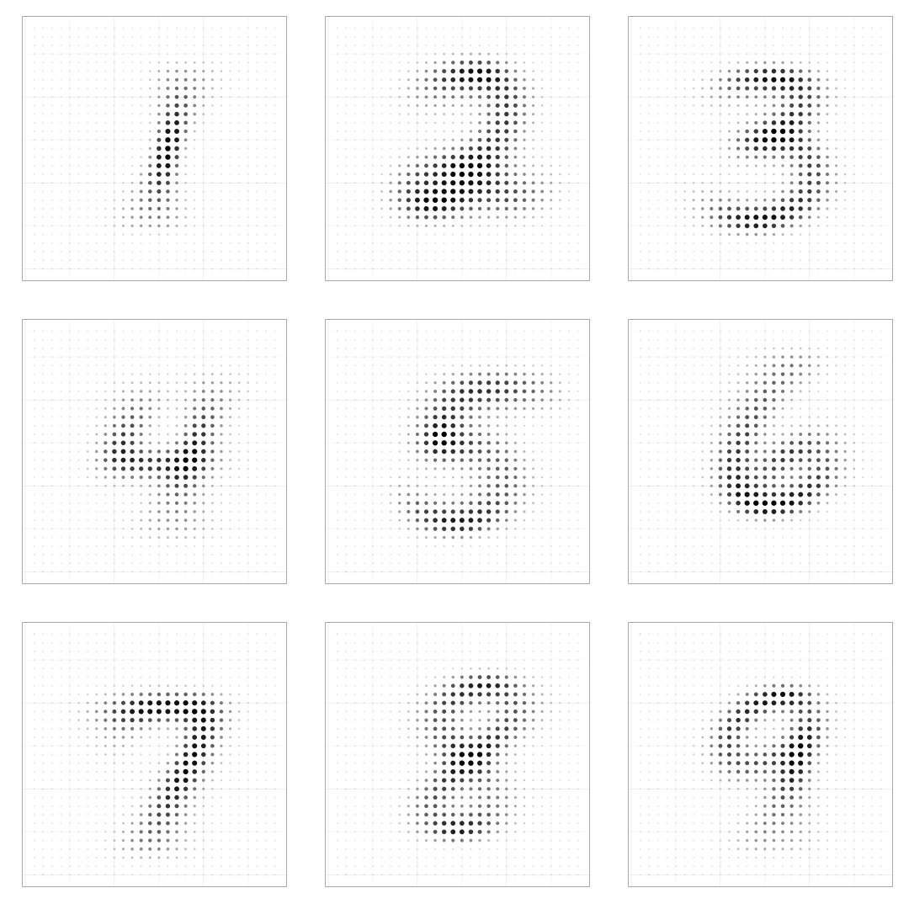

# Digit Recognizer

Hi, I am still learning R, but I manage to do something.

Those are the average digits, I didn't use in this version because its requires a lot of processing time. Not on the mood.

The code calculates splits the image in quadrants. The image can splited in 3x3 like a hashtag or in different dimensions. Then for each dimension it calculates some statistical variable. Mean, Standard Deviation, Skewness and Kurtosis. then randomForest.

I rekon that I barely undertand the concept of Kurtosis. The fun of machine learning is that it might show some success even if you don't know that properly. If something is unknow, it is possible to go after it to understand.

The system calculates its variables for each row and create a new data frame of features. It binds the label and is passed trough a randomForest.

No parameters are set yet. The most I did was make some changes on ntree. It shows improvement as it increases, but not meaningfull to worth the brute force. There is a high asymptote.

I also tried different breaks and checked the error rate for each one. It seems there isn't many differences in split the image of more than 4 breaks. And as the image is more fragmented, more processor time is taken. You can see in the char the error rate against numbers of breaks.

It's a little bit messy yet, but I pretend to work some more, but it can me delayed. I am kind of busy trying to set up the first robo advisor in my country.

